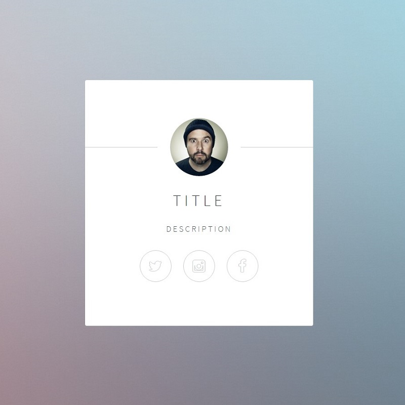

# Identity

Identity is a simple Grav theme, originally designed by HTML5 UP.

# Installation

Installing the Identity theme can be done in one of two ways. The GPM (Grav Package Manager) installation method enables you to quickly and easily install the theme with a simple terminal command, while the manual method enables you to do so via a zip file.

## GPM Installation (Preferred)

The simplest way to install this theme is via the [Grav Package Manager (GPM)](http://learn.getgrav.org/advanced/grav-gpm) through your system's Terminal (also called the command line).  From the root of your Grav install type:

    bin/gpm install identity

This will install the Identity theme into your `/user/themes` directory within Grav. Its files can be found under `/your/site/grav/user/themes/identity`.

## Manual Installation

To install this theme, just download the zip version of this repository and unzip it under `/your/site/grav/user/themes`. Then, rename the folder to `identity`. You can find these files either on [GitHub](https://github.com/lab-dev-code/grav-theme-identity) or via [GetGrav.org](http://getgrav.org/downloads/themes).

You should now have all the theme files under

    /your/site/grav/user/themes/identity

# Updating

## GPM Update (Preferred)

The simplest way to update this theme is via the [Grav Package Manager (GPM)](http://learn.getgrav.org/advanced/grav-gpm). You can do this with this by navigating to the root directory of your Grav install using your system's Terminal (also called command line) and typing the following:

    bin/gpm update identity

This command will check your Grav install to see if your Identity theme is due for an update. If a newer release is found, you will be asked whether or not you wish to update. To continue, type `y` and hit enter. The theme will automatically update and clear Grav's cache.

## Manual Update

Manually updating Identity is pretty simple. Here is what you will need to do to get this done:

* Delete the `your/site/user/themes/identity` directory.
* Download the new version of the identity theme from either [GitHub](https://github.com/lab-dev-code/grav-theme-identity) or [GetGrav.org](http://getgrav.org/downloads/themes).
* Unzip the zip file in `your/site/user/themes` and rename the resulting folder to `identity`.
* Clear the Grav cache. The simplest way to do this is by going to the root Grav directory in terminal and typing `bin/grav clear-cache`.

> Note: Any changes you have made to any of the files listed under this directory will also be removed and replaced by the new set. Any files located elsewhere (for example a YAML settings file placed in `user/config/themes`) will remain intact.

## Features

* Lightweight and minimal for optimal performance
* Fully responsive with off-page mobile navigation
* SCSS based CSS source files for easy customization
* Fontawesome icon support

### Supported Page Templates

* Default view template

### How to use it ?

A complete Identity page front-matter looks this way :

    ---
    title: "Title"
    avatar: "http://url/of/an/avatar"
    description: "Description"
    twitter: "http://url/of/a/twitter/account"
    facebook: "http://url/of/a/facebook/account"
    instagram: "http://url/of/a/instagram/account"
    credits:
        url: "http://url/of/your/credits/link"
        text: "Text of your credits link"
    ---
